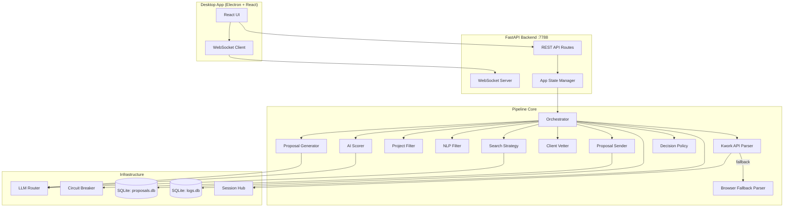
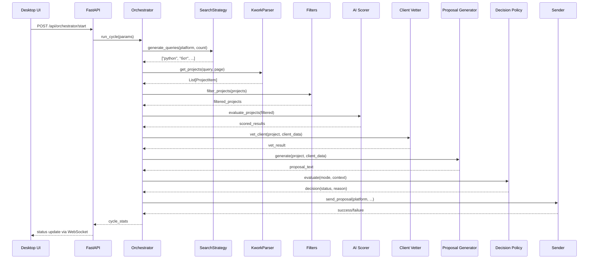

# Design Document: Production-Ready Overhaul

## Overview

Комплексная переработка PSR-агента для достижения production-ready состояния. Фокус на единственной рабочей платформе (Kwork), исправлении критических багов парсинга/поиска, повышении качества генерируемых откликов, создании Desktop UI и удалении мёртвого кода.

Ключевые принципы переработки:
- **Единственная платформа**: Kwork — единственная активная платформа; код для freelance_ru и hh_ru остаётся, но не инициализируется по умолчанию
- **Минимальная конфигурация**: Система работает с GROQ_API_KEY + KWORK_EMAIL/PASSWORD + SEARCH_BRIEF
- **Graceful degradation**: Каждый компонент обрабатывает ошибки без аварийного завершения
- **Observability**: Структурированное логирование каждого этапа с метриками в SQLite

## Architecture

### Высокоуровневая архитектура



### Поток данных Pipeline



### Принципы архитектуры

1. **Single Responsibility**: Каждый модуль отвечает за один этап pipeline
2. **Fail-safe по элементу**: Ошибка обработки одного заказа не останавливает цикл
3. **Runtime configuration**: Параметры цикла передаются через env-overrides, восстанавливаются после завершения
4. **Health-aware routing**: LLM Router выбирает провайдера по health-score с автоматическим fallback

## Components and Interfaces

### 1. KworkService (src/platforms/kwork.py)

Обёртка над библиотекой `kwork` для авторизации и управления сессиями.

```python
class KworkService:
    async def get_api(self) -> Optional[KworkAPI]:
        """Возвращает авторизованный API-клиент или None."""
        # 1. Попытка получить куки из Session Hub (приоритет)
        # 2. Fallback на email/password авторизацию
        # 3. Retry с задержкой 5с при 401
        # 4. Максимум 3 сброса сессии за цикл

    def reset_api(self) -> None:
        """Сбрасывает текущий клиент для реавторизации."""

    async def get_projects(self, **kwargs) -> List[RawProject]:
        """Вызов API с валидацией ответа."""

    async def close(self) -> None:
        """Закрытие ресурсов."""
```

### 2. KworkAPIParser (src/parsers/kwork_api_parser.py)

Парсер заказов через мобильный API с fallback на браузер.

```python
class KworkAPIParser(BaseParser):
    PLATFORM_NAME = "kwork"

    async def get_projects(self, page, per_page, filters) -> List[ProjectItem]:
        """
        1. Получить API-клиент через KworkService
        2. Для каждого query: resolve categories → вызов API
        3. При 3 ошибках подряд → fallback на браузер
        4. Нормализация в ProjectItem
        5. Дедупликация по id
        """

    def _resolve_categories(self, query: str) -> List[int]:
        """Маппинг слов запроса на category_ids Kwork."""
        # Дефолт: [11] (скрипты и автоматизация)
```

### 3. SearchStrategy (src/brain/search_strategy.py)

AI-генерация поисковых запросов с учётом истории сигналов.

```python
class SearchStrategy:
    async def generate_queries(self, platform: str, count: int) -> List[str]:
        """
        1. Читает SEARCH_BRIEF (или SEARCH_QUERY как fallback)
        2. Загружает preferred/learned/negative из query_memory
        3. Генерирует через LLM (task=query_generation)
        4. Merge: preferred → learned → ai → fallback
        5. Исключает negative queries
        6. Возвращает до count запросов (1-3 слова, ≤50 символов)
        """
```

### 4. ProposalGenerator (src/action/proposal_generator.py)

Генерация откликов через LLM с RAG-контекстом.

```python
class ProposalGenerator:
    async def generate(self, project: ProjectItem, **kwargs) -> str:
        """
        1. Подбор кейса из портфолио (пересечение технологий)
        2. Формирование промпта с контекстом заказчика
        3. Вызов LLM (task=proposal_writing)
        4. Очистка: markdown, эмодзи, цены, вводные фразы
        5. Валидация: 3-5 предложений, технический подход, вопрос
        6. Fallback на шаблонный генератор при ошибке
        """

    def _clean_proposal(self, text: str) -> str:
        """Удаление markdown, эмодзи, цен, вводных фраз."""

    def _find_best_case(self, project_skills: List[str]) -> Optional[dict]:
        """Поиск кейса с максимальным пересечением технологий."""
```

### 5. LLMRouter (src/brain/llm_router.py)

Health-aware маршрутизатор LLM-провайдеров.

```python
class LLMRouter:
    async def generate(self, prompt, provider, model, task, ...) -> str:
        """
        1. Определить список кандидатов (preferred → health-sorted)
        2. Для каждого: select_model(provider, task) → generate
        3. При ошибке: record_failure → try next
        4. Все упали → raise ValueError
        """

    def get_provider_health(self) -> Dict[str, ProviderHealthDict]:
        """In-memory статистика: success, failure, consecutive_failures, health_score."""
```

### 6. CircuitBreaker (src/utils/circuit_breaker.py)

Защита от каскадных сбоев при отправке.

```python
class CircuitBreaker:
    def allow(self, key: str) -> bool:
        """CLOSED→allow, OPEN→deny (until recovery), HALF_OPEN→allow one."""

    def record_success(self, key: str) -> None:
        """Reset to CLOSED."""

    def record_failure(self, key: str, error: str) -> None:
        """Increment failures; trip to OPEN at threshold (3)."""
```

### 7. Orchestrator (src/orchestrator.py)

Центральный модуль управления циклом.

```python
class FreelanceOrchestrator:
    async def run_cycle(self, dry_run: bool, limit_per_platform: int) -> Dict[str, int]:
        """
        Полный цикл:
        1. generate_queries → parse → deduplicate
        2. keyword_filter → nlp_filter → ai_score → vet_client
        3. generate_proposal → decision_policy → send/queue
        4. Return stats dict
        """

    async def execute_candidate_action(self, candidate_id, action, payload) -> str:
        """Обработка approve/skip/edit от пользователя."""
```

### 8. Desktop UI (desktop/)

Electron + React приложение.

```
Страницы:
- Dashboard: статус pipeline, текущий этап, счётчики
- Candidates: список с пагинацией, approve/skip/edit
- Settings: runtime-параметры с валидацией
- Logs: real-time WebSocket лог
```

### 9. FastAPI Backend (src/api/)

REST + WebSocket API для Desktop UI.

```
Endpoints:
- POST /api/orchestrator/start — запуск цикла с runtime env overrides
- POST /api/orchestrator/stop — остановка цикла
- GET /api/orchestrator/status — текущий статус
- GET /api/candidates — список с пагинацией
- POST /api/candidates/{id}/approve — подтверждение
- POST /api/candidates/{id}/skip — пропуск
- PATCH /api/candidates/{id} — редактирование текста/цены
- GET /api/settings — текущие настройки
- PUT /api/settings — обновление runtime-настроек
- WS /ws — real-time логи и статус
```

## Data Models

### ProjectItem (Pydantic)

```python
class ProjectItem(BaseModel):
    id: str                          # ID проекта на платформе
    title: str                       # Заголовок
    description: str                 # Описание
    budget: Optional[float] = None   # Бюджет (RUB)
    currency: str = "RUB"
    skills: List[str] = []           # Технологии/навыки
    url: str                         # URL проекта
    platform: str                    # "kwork"
    created_at: str                  # Дата создания
    client_user_id: Optional[str]    # ID заказчика
    offers_count: int = 0            # Количество откликов
    client_hired_percent: int = 0    # % найма заказчика
    search_query: Optional[str]      # Запрос, по которому найден
    platform_data: Dict[str, Any] = {}  # Сырые данные платформы
```

### Candidate (SQLite: proposals.db)

```sql
CREATE TABLE candidates (
    id INTEGER PRIMARY KEY AUTOINCREMENT,
    project_id TEXT NOT NULL,
    platform TEXT NOT NULL,
    title TEXT,
    description TEXT,
    url TEXT,
    budget REAL,
    skills TEXT,                    -- JSON array
    stage TEXT,                     -- parsed|filtered|scored|vetted|generating|sending
    status TEXT,                    -- parsed|filtered|scored|vetted|queued|auto_ready|
                                   -- manual_sent|auto_sent|draft|skipped|error|pending_review
    execution_mode TEXT,
    ai_pre_score REAL,
    ai_score REAL,
    ai_score_source TEXT,
    ai_reason TEXT,
    vet_score REAL,
    vet_passed INTEGER,
    vet_reasons TEXT,               -- JSON array
    vet_red_flags TEXT,             -- JSON array
    client_context TEXT,            -- JSON object
    proposal_text TEXT,
    chosen_price TEXT,
    provider TEXT,                  -- LLM provider used
    decision_reason TEXT,
    risk_level TEXT,
    priority INTEGER,
    auto_eligible INTEGER,
    dry_run INTEGER DEFAULT 0,
    search_query TEXT,
    offers_count INTEGER DEFAULT 0,
    client_hired_percent INTEGER DEFAULT 0,
    competitor_prices TEXT,         -- JSON array
    manual_override INTEGER DEFAULT 0,
    created_at TIMESTAMP DEFAULT CURRENT_TIMESTAMP,
    updated_at TIMESTAMP DEFAULT CURRENT_TIMESTAMP,
    UNIQUE(project_id, platform)
);
```

### Query Memory (SQLite: proposals.db)

```sql
CREATE TABLE query_memory (
    id INTEGER PRIMARY KEY AUTOINCREMENT,
    platform TEXT NOT NULL,
    query_text TEXT NOT NULL,
    runs INTEGER DEFAULT 0,
    total_results INTEGER DEFAULT 0,
    shortlisted_count INTEGER DEFAULT 0,
    sent_count INTEGER DEFAULT 0,
    responded_count INTEGER DEFAULT 0,
    user_preferred INTEGER DEFAULT 0,
    last_run_at TIMESTAMP,
    created_at TIMESTAMP DEFAULT CURRENT_TIMESTAMP,
    UNIQUE(platform, query_text)
);
```

### Cycle Metrics (SQLite: logs.db)

```sql
CREATE TABLE cycle_logs (
    id INTEGER PRIMARY KEY AUTOINCREMENT,
    cycle_started_at TIMESTAMP,
    cycle_ended_at TIMESTAMP,
    parsed INTEGER DEFAULT 0,
    active INTEGER DEFAULT 0,
    keyword_filtered INTEGER DEFAULT 0,
    nlp_filtered INTEGER DEFAULT 0,
    ai_passed INTEGER DEFAULT 0,
    vetted INTEGER DEFAULT 0,
    queued INTEGER DEFAULT 0,
    auto_ready INTEGER DEFAULT 0,
    sent INTEGER DEFAULT 0,
    errors INTEGER DEFAULT 0,
    duration_ms INTEGER
);
```

### ProviderHealth (in-memory)

```python
@dataclass
class ProviderHealth:
    success: int = 0
    failure: int = 0
    consecutive_failures: int = 0
    last_success_at: float = 0.0
    last_failure_at: float = 0.0
    last_error: str = ""
    last_model: str = ""
    tasks: Dict[str, Dict[str, int]] = field(default_factory=dict)

    def score(self) -> float:
        """Health score: 100 + bonuses - penalties."""
```

### Runtime Settings (Desktop → Backend)

```python
class CycleRequest(BaseModel):
    dry_run: bool = False
    limit: int = 5
    platforms: Optional[List[str]] = None       # ["kwork"]
    pages_to_parse: Optional[int] = None        # 1-10
    query_count: Optional[int] = None           # 1-20
    top_projects: Optional[int] = None          # 0-50
    search_brief: Optional[str] = None          # до 500 символов
    browser_headless: Optional[bool] = None
    osint_enabled: Optional[bool] = None
    telegram_enabled: Optional[bool] = None
    session_hub_required: Optional[bool] = None
```

## Correctness Properties

*A property is a characteristic or behavior that should hold true across all valid executions of a system — essentially, a formal statement about what the system should do. Properties serve as the bridge between human-readable specifications and machine-verifiable correctness guarantees.*

### Property 1: ProjectItem normalization safety

*For any* raw API response (valid, malformed, null, wrong type, or with missing fields), the normalization function SHALL either produce a list of ProjectItem objects where each has a non-empty `id`, non-empty `title`, and a URL matching `https://kwork.ru/projects/{id}` — or return an empty list without raising an exception.

**Validates: Requirements 1.2, 1.6**

### Property 2: Query normalization constraints

*For any* input string, the `_normalize_query` function SHALL produce an output that is at most 50 characters long, contains only lowercase alphanumeric characters (Latin and Cyrillic), spaces, hyphens, and plus signs, and has no leading/trailing whitespace.

**Validates: Requirements 2.1**

### Property 3: Query merge ordering invariant

*For any* set of preferred queries, learned queries, AI-generated queries, and negative queries, the `_merge_queries` function SHALL produce a list where: (a) all preferred queries appear before learned queries, (b) all learned queries appear before AI-generated queries, (c) no query from the negative set appears in the output, and (d) there are no duplicates.

**Validates: Requirements 2.4**

### Property 4: Category resolution from keywords

*For any* search query string, the `_resolve_categories` function SHALL return a non-empty list of category IDs where: if the query contains at least one keyword from KWORK_CATEGORIES_MAP, the returned categories match the union of mapped categories for all matching keywords; if no keyword matches, the result is `[11]` (default category).

**Validates: Requirements 2.5, 2.6**

### Property 5: Portfolio case selection by maximum intersection

*For any* portfolio of cases (each with a set of technologies) and any project with a set of skills, the `_find_best_case` function SHALL return the case with the maximum number of overlapping technologies with the project skills, or None if no case has any overlap.

**Validates: Requirements 3.2, 3.3**

### Property 6: Proposal text cleaning

*For any* input text, the `_clean_proposal` function SHALL produce output that contains no markdown symbols (`*`, `#`, `_`, `` ` ``), no emoji characters, no monetary amounts (digits followed by ₽/руб/RUB/$), and no introductory phrases ("Вот ваш отклик", "Конечно", "Безусловно"). Additionally, the output SHALL not contain references to client profile data (phrases like "ваш профиль", "ваш GitHub", "ваша статистика", "процент найма").

**Validates: Requirements 3.5, 3.7**

### Property 7: Settings validation correctness

*For any* integer value and a defined valid range [low, high], the settings validation function SHALL accept values where low ≤ value ≤ high and reject values where value < low or value > high. Specifically: QUERY_COUNT in [1, 20], PAGES_TO_PARSE in [1, 10], TOP_PROJECTS in [0, 50], AI_SCORE_THRESHOLD in [1, 10], limit_per_platform in [1, 20].

**Validates: Requirements 4.5**

### Property 8: Runtime env override/restore round-trip

*For any* set of environment variable overrides applied via `_apply_runtime_env`, after calling `_restore_runtime_env` with the returned previous values, all affected environment variables SHALL have their original values (or be unset if they were originally unset).

**Validates: Requirements 4.6**

### Property 9: Pipeline fault isolation

*For any* list of projects where some subset causes exceptions during processing at any pipeline stage, the Orchestrator SHALL still process all non-failing projects to completion, setting only the failing projects' status to "error".

**Validates: Requirements 5.2**

### Property 10: Circuit breaker state machine correctness

*For any* sequence of `record_success` and `record_failure` calls on a CircuitBreaker instance: (a) the state transitions from CLOSED to OPEN only after `failure_threshold` (3) consecutive failures, (b) after transitioning to OPEN, `allow()` returns False until recovery time elapses, (c) after recovery time, state moves to HALF_OPEN and allows exactly one call, (d) a success in HALF_OPEN transitions to CLOSED and resets all failure counters.

**Validates: Requirements 5.3**

### Property 11: Cycle statistics structure invariant

*For any* completed orchestrator cycle (regardless of input data, errors, or empty results), the returned statistics dictionary SHALL contain exactly the keys: parsed, active, filtered, ai_passed, vetted, queued, auto_ready, sent — and each value SHALL be a non-negative integer.

**Validates: Requirements 5.5**

### Property 12: Session reset bounded per cycle

*For any* sequence of API calls within a single parsing cycle that return invalid session indicators, the KworkService SHALL perform at most 3 client resets. After 3 resets, subsequent invalid session responses SHALL not trigger additional resets.

**Validates: Requirements 7.7**

### Property 13: Stop word filtering

*For any* ProjectItem whose title or description contains at least one stop word from config/filters.yaml (case-insensitive substring match), the keyword filter SHALL exclude that project from its output.

**Validates: Requirements 8.1**

### Property 14: Budget range filtering

*For any* ProjectItem with a non-null budget value, the budget filter SHALL exclude it if budget < min_budget or budget > max_budget. For any ProjectItem with a null budget, the budget filter SHALL pass it through regardless of min_budget/max_budget settings.

**Validates: Requirements 8.2, 8.6**

### Property 15: Score threshold decision

*For any* AI score value (integer 1-10) and any threshold value (integer 1-10), the scoring stage SHALL pass the project if and only if score ≥ threshold.

**Validates: Requirements 8.3**

### Property 16: Deduplication by platform and project_id

*For any* list of ProjectItem objects, after deduplication by (platform, project_id), the output SHALL contain no two items with the same (platform, id) pair, and for each unique pair, the first occurrence from the input is preserved.

**Validates: Requirements 8.4**

### Property 17: Dry run mode invariant

*For any* set of candidates processed while dry_run=True, all candidates SHALL receive status "draft" and no actual platform send operation SHALL be invoked.

**Validates: Requirements 9.6**

### Property 18: LLM Router provider ordering by health-score

*For any* set of registered providers with varying ProviderHealth states, the `_candidate_providers` function SHALL return providers sorted by descending health-score (after any explicitly preferred provider). Recording N successes SHALL increase health-score, and recording N failures SHALL decrease it, with consecutive failures having a stronger penalty.

**Validates: Requirements 10.2, 10.4**

### Property 19: Edit validation constraints

*For any* proposal text and price submitted for editing, the validation SHALL accept text with length in [1, 2000] characters and price within [min_budget, max_budget] from config/filters.yaml, and SHALL reject text with length 0 or > 2000, or price outside the configured range.

**Validates: Requirements 9.3**

## Error Handling

### Стратегия обработки ошибок по уровням

| Уровень | Поведение | Пример |
|---------|-----------|--------|
| **Элемент** | Логировать, пометить error, продолжить | Ошибка скоринга одного проекта |
| **Этап** | Логировать, вернуть пустой результат этапа | Все проекты упали на NLP-фильтре |
| **Компонент** | Fallback на альтернативу | API → браузер, Groq → Google |
| **Цикл** | Завершить штатно, вернуть нулевую статистику | Все парсеры недоступны |
| **Система** | Логировать CRITICAL, уведомить пользователя | Невозможно записать в БД |

### Конкретные сценарии

1. **Kwork API недоступен**: 3 ошибки подряд → fallback на браузерный парсер → если и он недоступен → пустой список, цикл продолжается
2. **LLM провайдер упал**: Автоматический fallback на следующий по health-score → все упали → исключение, кандидат получает status=error
3. **Отправка отклика не удалась**: CircuitBreaker записывает failure → при 3 подряд → OPEN на 120с с экспоненциальным backoff → кандидаты ставятся в queued
4. **Session Hub недоступен**: При SESSION_HUB_REQUIRED=false → fallback на email/password → при отсутствии credentials → None без исключения
5. **WebSocket разрыв**: Desktop UI показывает индикатор → автоматическое переподключение каждые 5с → до 10 попыток
6. **Невалидный ответ API**: Проверка типа/наличия поля `response` → при несоответствии → пустой список, без исключения

### Логирование ошибок

- Все ошибки логируются через loguru с уровнем ERROR или WARNING
- Структурированные метрики записываются в logs.db
- Каждая ошибка содержит: этап, идентификатор элемента, текст ошибки, длительность операции
- Circuit Breaker состояния персистятся в logs.db для восстановления после рестарта

## Testing Strategy

### Подход к тестированию

Используется двойной подход:
- **Property-based tests (PBT)**: Проверка универсальных свойств на большом количестве сгенерированных входов
- **Unit tests**: Конкретные примеры, edge cases, интеграционные сценарии

### Библиотека для PBT

**Hypothesis** (Python) — стандартная библиотека property-based testing для Python.

Конфигурация:
- Минимум 100 итераций на каждый property test
- Каждый тест помечен комментарием с ссылкой на property из design document
- Формат тега: `# Feature: production-ready-overhaul, Property {N}: {title}`

### Структура тестов

```
tests/
├── properties/                    # Property-based tests
│   ├── test_normalization.py      # Properties 1, 2
│   ├── test_search_strategy.py    # Properties 3, 4
│   ├── test_proposal.py           # Properties 5, 6
│   ├── test_validation.py         # Properties 7, 19
│   ├── test_env_roundtrip.py      # Property 8
│   ├── test_circuit_breaker.py    # Property 10
│   ├── test_filtering.py          # Properties 13, 14, 15, 16
│   ├── test_llm_router.py         # Property 18
│   └── test_orchestrator.py       # Properties 9, 11, 12, 17
├── unit/                          # Example-based unit tests
│   ├── test_kwork_parser.py
│   ├── test_search_fallback.py
│   ├── test_session_management.py
│   ├── test_decision_policy.py
│   └── test_proposal_generator.py
├── integration/                   # Integration tests
│   ├── test_api_endpoints.py
│   ├── test_websocket.py
│   ├── test_full_cycle.py
│   └── test_kwork_auth.py
└── conftest.py                    # Shared fixtures, generators
```

### Генераторы для PBT

Ключевые Hypothesis стратегии:
- `project_items()` — генерация случайных ProjectItem с варьирующимися полями
- `raw_api_responses()` — генерация сырых ответов API (валидных и невалидных)
- `query_strings()` — генерация поисковых запросов разной длины и содержания
- `proposal_texts()` — генерация текстов с markdown, emoji, ценами
- `health_sequences()` — генерация последовательностей success/failure
- `env_overrides()` — генерация наборов env-переменных

### Unit Tests (примеры и edge cases)

- Авторизация: Session Hub → email/password → retry → None
- Fallback: API 3 ошибки → браузер → stateData → HTML → пустой список
- Circuit Breaker: 2 ошибки (CLOSED) → 3 ошибки (OPEN) → recovery → HALF_OPEN → success (CLOSED)
- LLM Router: preferred provider → health fallback → all fail → exception
- Desktop UI: start/stop cycle, WebSocket reconnect, settings validation

### Запуск тестов

```bash
# Все тесты
pytest tests/ --run

# Только property tests
pytest tests/properties/ --run -v

# С увеличенным количеством примеров
pytest tests/properties/ --run --hypothesis-seed=0 -v
```

